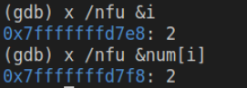

## Computer Architecture Lab
### Assignment Requirements
- Write a Fibonacci.c storing the first ten sequence numbers. Run the Fibonacci program in your computer, analyze the assembly code for the Fibonacci.c.
- Observe the memory areas in bytes for the Fibonacci numbers given by the computer where the Fibonacci program running. Analyze what you have seen.
- Cross compile the Fibonacci.c for RISC-V targets, or write the assembly code of Fibonacci.c in RISC-V assembly language, and run it in RISC-V online simulator (www.kvakil.me/venus/). Observe the memory areas in bytes for the Fibonacci numbers given by the RISC-V simulator.
- Cross compile the Fibonacci.c for MIPS targets, or write the assembly code of Fibonacci.c in MIPS assembly language, and run it in Mars simulator. Observe the memory areas in bytes for the Fibonacci numbers given by the Mars simulator.
- write the assembly code of Fibonacci.c in MIPS assembly language, and run it in WinMIPS64 simulator. Observe the memory areas in bytes for the Fibonacci numbers given by the WinMIPS simulator.
- (optional) Cross compile the Fibonacci.c for LoongArch64 targets, analyze the assembly code of Fibonacci.c in LoongArch64.

#### Run file
Under main directory: 
```shell
bash ./mem_arch/run.sh
```

#### Debug with gbd
Add parameter "-g" while compiling the source file. Then use command
```shell
gbd obj.o
```
to initiate gdb mode.
Within the gdb mode:
- use command ***run*** to run whole file.
- use command ***next*** to run file step by step. #abbr: n
- use command ***break src.c:linenum*** to set breakpoint at line ***%linenum*** in file ***%src.c***
- use command ***print var*** to display the value of certain variable ***%var***.
- use command ***examine &var*** to check value in certain address of ***%var***. #abbr: x; parameters: /nfu.


### Analysis
#### Question 1
Instructions that have a prefix of "." are not the content of
original codes, these instructions are called the assembler instrctions which is for guiding the assembler to process codes.
Here I use command
```shell
objdump -d fibonacci.o
```
and
```shell
objdump -h fibonacci.o
```
to check the disassembly result of the executive file "fibonacci.o" 

The disassembly results of the main section could be recognized in the section *main* in file *dis_d.log*. Address from 0x1169 to 0x1229.
Some registers' functions in x86_64 are as follow:
- %rax: return value of function.
- %rsp: pointing to stack top.
- %rbp: pointing to stack bottom.
- %rdi, %rsi, %rdx, %rcx, %r8, %r9: parameters of functions.

##### Detailed analysis of assembly codes
```assembly
endbr64
```
This instruction is for protecting program not to be attacked by setting virtual table and controll the administrator permission in Intel CET structure. It could make sure that each jump between the different branchs is secured, which means, under Intel CET structure, program can only jump to a subprogram that begin with *endbr32/64*, otherwise with be recognized as *nop*.
```assembly
push    %rbq
mov     %rsp, %rbp
```
Push the stack-bottom-pointer into stack and let the stack-top-pointer point to the bottom. This action is for initializing a stack.

#### Question 2
Using gdb debug model to check address of variable, for example:
<center>



</center>

This example figure shows the address and value of variable *i* and variable *num[i]*. From the results, the address variable *i* is **0x7fffffffe8**, the address of array *num* is from **0xd2a66180** to **0xd2a661a4**, each element occupies 4 bytes. The detailed address could be seen in ***output.log***. And due to the memory occupation is different each time the program running, so their addresses are also distinct.


#### Question 3
Install risc-v cross compile tools chain. Refer to *risc-v/tools_chain_install.sh* for detailed installation steps.


### Relative reference links
- https://en.wikipedia.org/wiki/Control-flow_integrity
- https://blog.csdn.net/zhbt1234/article/details/54019620
- https://blog.csdn.net/m0_47096428/article/details/116721465
- https://www.intel.com/content/www/us/en/developer/articles/technical/intel-sdm.html
- https://blog.csdn.net/xiaozhiwise/article/details/122732433
- https://blog.csdn.net/qq_40836704/article/details/120391584