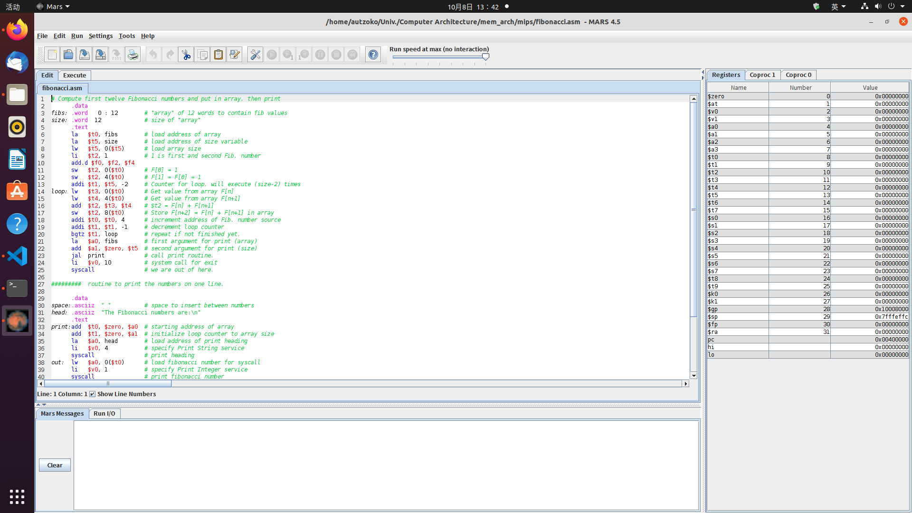
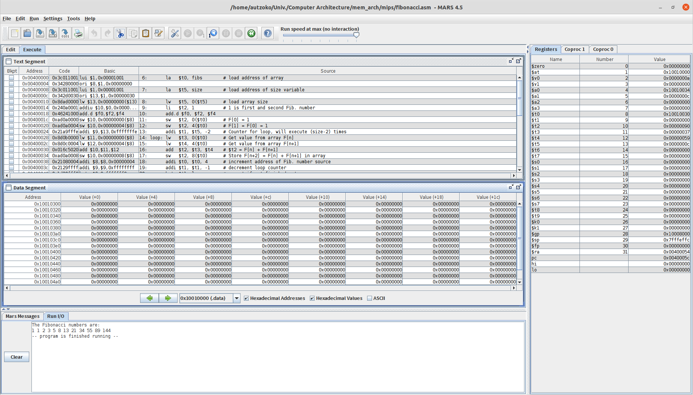

## Running on MIPS
### Running with Mars Simulator
#### Download MARS simulator and Guidence
Download link: http://courses.missouristate.edu/kenvollmar/mars/index.htm
Meanwhile, this website supports a example assembly file of fibonacci, which is contained in this ditectory. Open **fibonacci.asm** to check its codes.

#### Using Mars Simulator to Run MIPS Assembly Codes
Use command 
```shell
java -jar Mars4_5.jar
```
to open the simulator. Then click the *File* button on left top and select *Open* to open **fibonacci.asm**. Then Run the file.
The Mars simulator interface and running results will be shown below:

<center>





</center>

### Cross Compile
#### Problems with Installing cross compiler
Process always be killed during the make file step. I refered to the similar problem about installing LLVM on the Internet, then it can be compiled and passed after expanding the memory allocated to my virtual machine.

#### Compile
Use command
```shell
mipsel-linux-gcc ../fibonacci.c -o mips_fibonacci.o
```
to generate executive file of MIPS.
Use command
```shell
mipsel-linux-gcc ../fibonacci.c -S -o mips_fibonacci.s
```
to generate MIPS assembly codes.
