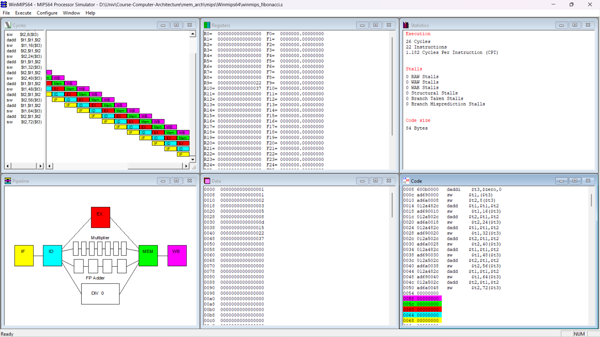

# WinMips64
! The format of MIPS assembly code in WinMIPS64 is different with the origin MIPS assembly code.

### Download WinMIPS64 on Windows
Download link: http://indigo.ie/~mscott/

## Result
Load the assembly code **winmips_fibonacci.s** on WinMIPS64 and press *F7* to run step by step. The operation only uses **$t1** and **$t2** registers, the results are saved to **0x00** to **0x48** in the memory which could be supervised in the window of *Data* in WinMIPS64.
The result screenshot is showed below:

