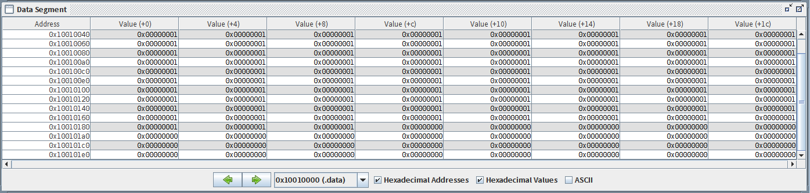
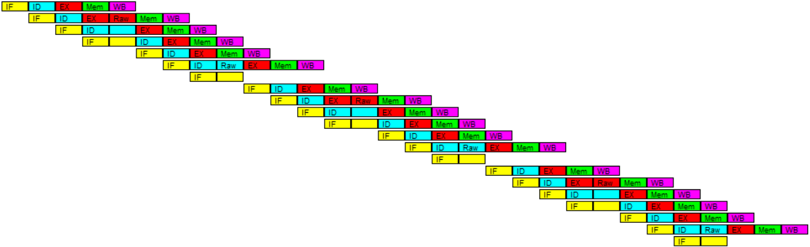
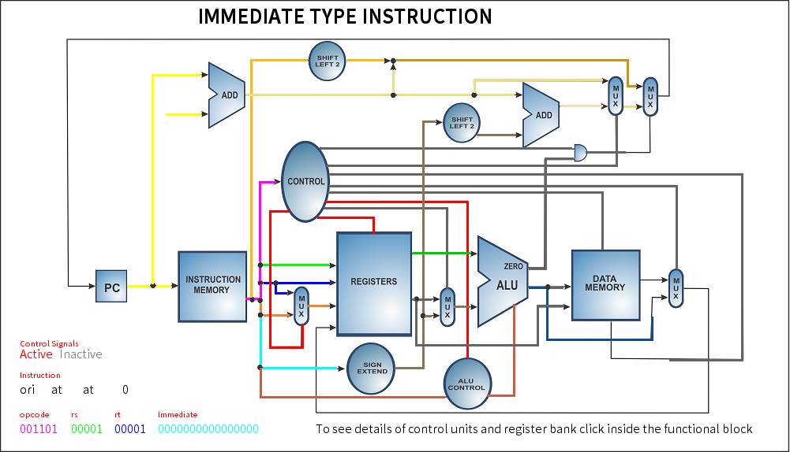

# Computer Architecture Lab: Analysis of Instruction Execution Pipeline

## Assignment Requirements
Using the following code fragment:
```assembly
Loop:
    LW      R1, 0(R2); Load R1 from address [0+R2]
    ADDI    R1, R1, #1; R1=R1+1
    SW      0(R2), R1; Store R1 at address [0+R2]
    ADDI    R2, R2, #4; R2=R2+4
    SUB     R4, R3, R2; R4=R3-R2
    BNEZ    R4, Loop; Branch to loop if R4 != 0
```
Assume that the initial value of R3 is R2+396.
Analyze (a) by showing the timing of the first two iterations and calculate the total cycles needed; implement (b) and (c) in WinMIPS64. Execute the code in MARS, describe the difference between WinMIPS64 and MARS.
- (a)**Show** the timing of this instruction sequence for the RISC pipeline **without any forwarding or bypassing** hardware but assuming *a register read and a write in the same clock cycle “forwards” through the register file. Assume that the branch is handled by flushing the pipeline.* If all memory references take 1 cycle, **how many** cycles does this loop take to execute?
- (b)**Show** the timing of this instruction sequence for the RISC pipeline **with normal forwarding and bypassing hardware.** *Assume that the branch is handled by predicting it as not taken.* If all memory references take 1 cycle, **how many** cycles does this loop take to execute?
- (c)Assume the RISC pipeline with a single-cycle delayed branch and normal forwarding and bypassing hardware. Schedule the instructions in the loop including the branch delay slot. You **may reorder instructions and modify the individual instruction operands**, but do not undertake other loop transformations that change the number or opcode of the instructions in the loop. **Show** a pipeline timing diagram and compute **the number of cycles needed** to execute the entire loop.

## Solutions

### MARS

To run the assembly code fragment, it is necessary to modify syntax of **lw** and **sw**.
The data segment in MARS begin at **0x10010000**, to avoid **lw** and **sw** operation out of address range, the initial value of
register **$t2** need to be set with the value of **0x10010000**.

The modified code could be seen in **code.s**.



As can be seen in the image above, the data **1** that saved into the memory(data segment) stops at address **0x10010180 + 8**, and it is metioned that the data segment begins at **0x10010000**, hence we can know that there are 99 data **1** have been saved to the memory, which means the *loop* has run 99 times. This is because that the initial value of register **$t3** is **$R2+396**, for 4 bits each data, this means 99 data.

### WinMIPS64

To run the assembly code on WINMIPS64, the initial value of register **$t2** need to be set to **0x00**, and instruction **addi** and **sub** need to be modified to **daddi** and **dsub**. The running result is similar to the MARS.

### Pipeline

The pipeline of **code_winmips.s** that shown in the WinMIPS64 is:



This table shows the operations amid each instruction.

|No.|Instrution|1|2|3|4|5|6|7|8|9|10|11|12|
|---|---|---|---|---|---|---|---|---|---|---|---|---|---|
|1|lw \$t1,0(\$t2)|IF|ID|EX|MEM|WB|||||||
|2|addi \$t1,\$t1,1||IF|ID|EX|RAW|MEM|WB||||||
|3|sw \$t1,0(\$t2)|||IF|ID|ST|EX|MEM|WB|||||
|4|addi \$t2,\$t2,4||||IF|ST|ID|EX|MEM|WB||||
|5|sub \$t4,\$t3,\$t2||||||IF|ID|EX|MEM|WB|||
|6|bnez \$t4,loop|||||||IF|ID|RAW|EX|MEM|WB|

It can be seen from the table that a loop takes 12 clock cycles, and absolutely have **STALL**.
The first **STALL** happens at instrution **sw \$t1, 0(\$t2)**



